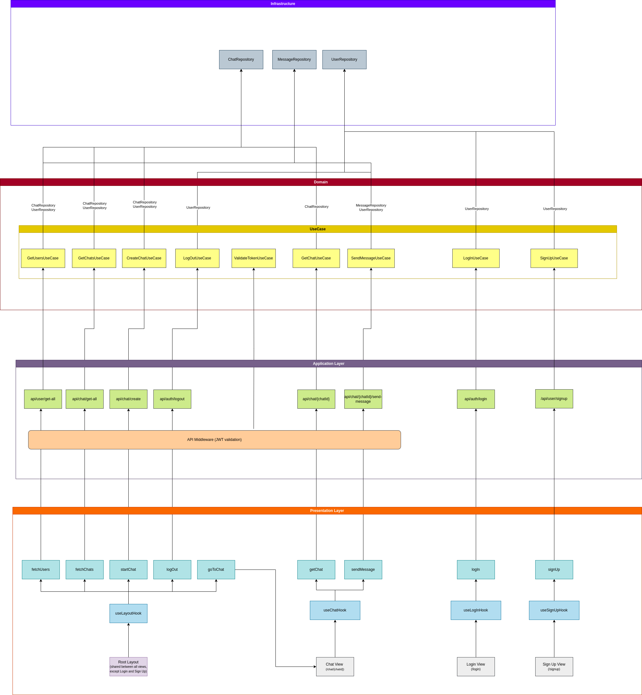

# Real Time Chat App

## Introducción 🚀

Esta aplicación de Chat en tiempo real está desarrollada con Next.JS, TypeScript y MongoDB, y se ha construido como un monolito altamente modularizado. Esto permite la extracción del backend para su implementación en un servicio independiente, utilizando otro framework de backend en JavaScript (usando TypeScript).

La arquitectura del software sigue principios de arquitectura limpia, incorporando conceptos como Repository y Use Cases para asegurar una estructura modular y mantenible. Además, la aplicación incluye funcionalidades de chat en tiempo real gracias a la librería Socket.IO, proporcionando una experiencia de comunicación instantánea entre los usuarios.

La interacción entre el backend y el frontend se realiza mediante un token JWT enviado a través de las cookies, asegurando una comunicación segura y autenticada entre los distintos componentes de la aplicación.

## Índice 📖

1. [Requisitos](#requisitos)
2. [Instalación](#instalación)
3. [Configuración](#configuración)
4. [Uso](#uso)
5. [Arquitectura](#arquitectura)
   1. [Backend](#backend)
   2. [Frontend](#frontend)
6. [Estructura de directorios](#estructura-de-directorios)
7. [Diagrama de la aplicación](#diagrama-de-la-aplicación)
8. [Githooks](#githooks)

## Requisitos 📋

Antes de comenzar, asegúrese de tener contar con:

- **[Node.js](https://nodejs.org/en)**: >= 18.17
- **[npm](https://www.npmjs.com/)**: >= 9.8
- **[Docker](https://www.docker.com/)** >= 24.0
- **[Docker Compose](https://docs.docker.com/compose/install/)** >= 2.21

## Instalación ⚙️

1. Clone el repositorio:

```
git clone https://github.com/jeremiaspuerta/real-time-chat.git
```

2. Instale las dependencias:

```
cd real-time-chat && npm install
```

## Configuración 🔧

Copie el archivo `.env.example` con el nombre `.env` en la raíz del proyecto. El archivo `.env.example` contiene las variables requeridas con valores por defectos completamente funcionales.

## Uso 🚦

Inicie el contenedor de Docker:

```
docker compose up
```

Inicie el servidor de Websocket:

```
npm run server
```

Inicie la aplicación en modo de desarrollo:

```
npm run dev
```

La aplicación estará disponible en http://localhost:3000.

## Arquitectura 🏗️

### Backend 🌐

El backend de esta aplicación se ha diseñado siguiendo algunos principios de arquitectura limpia. Se han implementado conceptos como Repository, Repository Interface y Use Cases para garantizar una estructura modular y mantenible.

> ℹ️ Para más información sobre Arquitecturas limpias, consultar el [siguiente artículo](https://blog.cleancoder.com/uncle-bob/2012/08/13/the-clean-architecture.html).

### Frontend 🖥️

La arquitectura de frontend se sustenta en el patrón de diseño Hook, aprovechando las capacidades que ofrece React para gestionar el estado y el ciclo de vida de los componentes de manera más eficiente.

> ℹ️ Para más información sobre el patrón Hooks, consultar el [siguiente artículo](https://www.patterns.dev/react/hooks-pattern/).

## Estructura de directorios 📂

Next.JS 14 naturalmente utiliza el directorio `src/` para envolver tanto los componentes, como asi tambien cada una de las rutas y la API.
Siguiendo las convenciones del framework, el directorio `app/` se utiliza como ruteo de las paginas (`/login`,`/signup`,`/chat`) y de la propia API (`/api`).
El directorio `Backend/` envuelve toda la lógica de la aplicación utilizando algunos principios de arquitectura limpia. Dentro del directorio `Domain/` se encuentran las RepositoryInterfaces (interfaces implementadas por los Repository) y los Use Cases (acciones que realizara el usuario dentro del sistema). En el directorio `Infrastructure/` se implementan los repositorios de la aplicación (`ChatRepository`,`MessageRepository` y `UserRepository`), es aquí donde se interactura directamente con la base de datos a través del ORM (en este caso con [Prisma](https://www.prisma.io/)).
Dentro del directorio `UI/` se encuentran `Components/` (componentes referentes a la UI del usuario), `Hooks/` (Hooks custom que hace manejo de la lógica dentro del Frontend, principalemente se realizan las request a la API) y `Styles/`, (CSS usados tanto en las páginas como en los componentes).
Por último tenemos el directorio `Shared/`, en donde se encuentran `Constants/` (constantes usados tanto en el backend como en el frontend), `Helpers/` y types para variables.

- `src`
  - `app`
    - `(chat)`
      - `chat`
    - `login`
    - `signup`
    - `api`
      - `auth`
      - `chat`
      - `user`
  - `Backend`
    - `Domain`
      - `RepositoryInterface`
      - `UseCase`
    - `Infrastructure`
      - ``repositories``
  - `UI`
    - `Components`
    - `Hooks`
    - `Styles`
  - `Shared`
    - `Constants`
    - `Helpers`
    - ``Types.ts``

## Diagrama de la aplicación 🔄

El siguiente diagrama debe observarse desde abajo hacia arriba para comprender el funcionamiento del sistema:



## Githooks 🪝

Se ha configurado la librería [Husky](https://www.npmjs.com/package/husky) para gestionar los githooks. En particular, se utiliza pre-commit para ejecutar [ESlint](https://www.npmjs.com/package/eslint) y [Prettier](https://www.npmjs.com/package/prettier) antes de confirmar los cambios.
